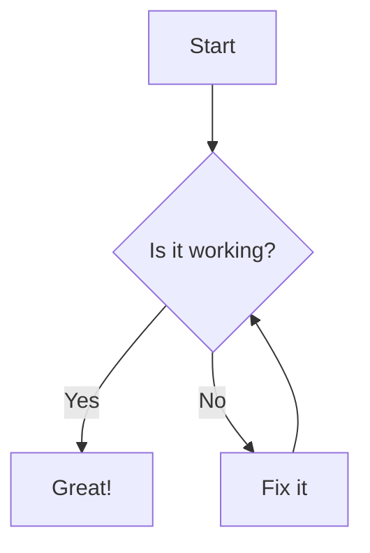

# Moremaid

A native macOS Markdown viewer with full Mermaid diagram support.

Browse markdown files with beautifully rendered diagrams, syntax-highlighted code, full-text search, encrypted archives, and 10 color themes.

> **This project is 100% AI-generated.** Every line of code, feature, architectural decision, and this README were created by [Claude](https://claude.ai) (Anthropic's AI). The human provided requirements and feedback; Claude handled all programming, debugging, and problem-solving.

## Features

### Rendering
- **Mermaid diagrams** -- flowcharts, sequence diagrams, Gantt charts, state diagrams, ER diagrams, and more
- **Syntax highlighting** for 20+ languages via Prism.js
- **Fullscreen diagrams** -- click to open any Mermaid diagram in its own window
- **Live reload** -- file changes are detected and re-rendered automatically

### Themes & Typography
- **10 color themes** -- Light, Dark, GitHub, GitHub Dark, Dracula, Nord, Solarized Light/Dark, Monokai, One Dark
- **6 typography styles** -- Default, GitHub, LaTeX, Tufte, Medium, Compact
- Theme selector in Preferences
- System dark mode detection

### Search
- **Fuzzy filename search** with relevance ranking
- **Full-text content search** with context snippets and match highlighting
- Toggle between modes with `TAB`
- Keyboard-driven navigation (`/` to focus, arrows to browse, `Enter` to open)

### Archive & Sharing
- **Pack** markdown projects into `.moremaid` archives
- **AES-256 encryption** -- optional password protection
- **In-memory browsing** -- encrypted files are never written to disk
- **Zero-install viewing** -- open `.moremaid` archives directly in the app

### macOS App

- **Multi-window** with session restore and tab support
- **Quick Open** (`Cmd+P`) -- fuzzy file finder
- **Search in Files** (`Cmd+Shift+F`) -- content search across all files
- **Activity Feed** (`Cmd+Shift+A`) -- real-time file change tracking via FSEvents
- **QuickLook extension** -- preview markdown files directly in Finder
- **Bundled CLI** (`mm`) -- installable to `/usr/local/bin`
- **Drag & drop** -- open files and folders by dropping them on the window
- **Live reload** -- watches files for changes and re-renders automatically
- **Breadcrumb navigation** and table of contents sidebar

## Mermaid Diagram Support

All Mermaid diagram types are supported:

````markdown

````


Click the fullscreen button on any diagram to open it in a dedicated window. Diagrams automatically adapt to the selected color theme.

## Architecture

```
Sources/
├── App/         # Lifecycle, preferences, state persistence
├── FileBrowser/ # Directory view, WebView, TOC, tabs, search
├── Rendering/   # HTMLGenerator, themes, page scripts
├── Search/      # Fuzzy matcher, content search
├── Archive/     # ZIP virtual filesystem, LRU cache
├── FileWatcher/ # FSEvents file monitoring
├── Shared/      # Models, constants, utilities
└── Validation/  # Mermaid syntax checking
CLI/             # Bundled `mm` command-line tool
QuickLook/       # Finder QuickLook extension
```

Built with SwiftUI and WebKit. `HTMLGenerator` produces inline HTML with marked.js, Prism.js, and Mermaid.js rendered through `WKWebView`.

## Open-Source Libraries

Moremaid is built on top of excellent open-source projects:

### Rendering (loaded via CDN)

| Library | Purpose | License |
|---------|---------|---------|
| [Marked](https://marked.js.org/) | Fast Markdown parser and compiler | MIT |
| [marked-gfm-heading-id](https://github.com/markedjs/marked-gfm-heading-id) | GitHub-flavored heading anchors | MIT |
| [Mermaid](https://mermaid.js.org/) | Diagrams and flowcharts from text | MIT |
| [Prism.js](https://prismjs.com/) | Syntax highlighting for 200+ languages | MIT |
| [MiniSearch](https://lucaong.github.io/minisearch/) | Tiny full-text search engine | MIT |

### Native Dependencies

| Library | Purpose | License |
|---------|---------|---------|
| [ZIPFoundation](https://github.com/weichsel/ZIPFoundation) | Pure Swift ZIP archive handling | MIT |

## Requirements

- macOS 14.0+ (Sonoma)
- Built with Swift 6, SwiftUI, and WebKit

## Installation

### From source

Requires [Tuist](https://tuist.io) and [mise](https://mise.jdx.dev):

```bash
git clone https://github.com/thieso2/MoremaidApp.git
cd MoremaidApp
mise build      # build the app
mise run        # build and launch
mise test       # run unit tests
```

## Troubleshooting

**macOS app shows stale content** -- Don't use `open Moremaid.app`; use `mise run` or `mise debug` instead (macOS caches old binaries via LaunchServices).

## Contributing

Contributions are welcome! Open an issue or submit a pull request.

1. Fork the repository
2. Create your feature branch (`git checkout -b feature/amazing-feature`)
3. Run tests (`mise test`)
4. Commit and push
5. Open a Pull Request

## License

[MIT](LICENSE) -- Copyright (c) 2026 Thies C. Arntzen

---

Built with [Claude](https://claude.ai) | Powered by [Marked](https://marked.js.org/), [Mermaid](https://mermaid.js.org/), and [Prism.js](https://prismjs.com/)
