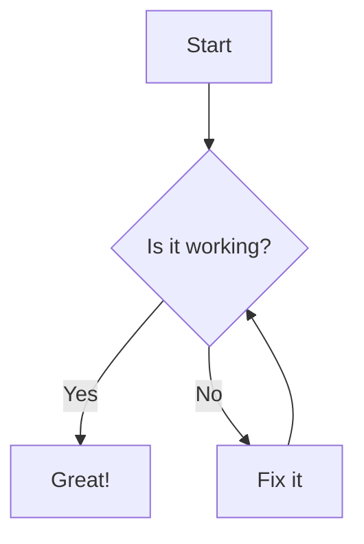

# Moremaid

A powerful Markdown viewer with full Mermaid diagram support. Available as a **Node.js CLI tool** and a **native macOS app**.

Browse markdown files with beautifully rendered diagrams, syntax-highlighted code, full-text search, encrypted archives, and 10 color themes.

> **This project is 100% AI-generated.** Every line of code, feature, architectural decision, and this README were created by [Claude](https://claude.ai) (Anthropic's AI). The human provided requirements and feedback; Claude handled all programming, debugging, and problem-solving.

## Quick Start

```bash
# No installation needed
npx moremaid README.md

# Or install globally
npm install -g moremaid
mm README.md
mm docs/            # browse a folder
mm project.moremaid # open an encrypted archive
```

## Features

### Rendering
- **Mermaid diagrams** -- flowcharts, sequence diagrams, Gantt charts, state diagrams, ER diagrams, and more
- **Syntax highlighting** for 20+ languages via Prism.js
- **Fullscreen diagrams** -- click to open any Mermaid diagram in its own window
- **Live reload** -- file changes are detected and re-rendered automatically

### Themes & Typography
- **10 color themes** -- Light, Dark, GitHub, GitHub Dark, Dracula, Nord, Solarized Light/Dark, Monokai, One Dark
- **6 typography styles** -- Default, GitHub, LaTeX, Tufte, Medium, Compact
- Theme selector on hover (CLI) or in Preferences (macOS app)
- System dark mode detection

### Search
- **Fuzzy filename search** with relevance ranking
- **Full-text content search** with context snippets and match highlighting
- Toggle between modes with `TAB`
- Keyboard-driven navigation (`/` to focus, arrows to browse, `Enter` to open)

### Archive & Sharing
- **Pack** markdown projects into `.moremaid` archives with `mm --pack docs/`
- **AES-256 encryption** -- optional password protection
- **In-memory browsing** -- encrypted files are never written to disk
- **Zero-install viewing** -- recipients run `npx moremaid project.moremaid`

### Modes of Operation

| Mode | Command | Description |
|------|---------|-------------|
| Single file | `mm file.md` | Serve one file with live reload |
| Folder | `mm docs/` | Browse a directory with file index and search |
| Multi-source | `mm a.md b.md docs/` | Merge multiple files/folders into one view |
| Archive | `mm project.moremaid` | Open encrypted or plain ZIP archives |
| Pack | `mm --pack docs/` | Create a `.moremaid` archive |
| Validate | `mm --validate docs/` | Check markdown and Mermaid syntax (CI-friendly) |

### CLI Options

```
mm [options] <file|folder|archive>

  -t, --theme <name>   Color theme (light, dark, github, github-dark, dracula,
                        nord, solarized-light, solarized-dark, monokai, one-dark)
  -d, --dark           Shortcut for --theme dark
  -p, --pack           Pack files into a .moremaid archive
  -k, --keep-running   Keep server alive after browser disconnects
  -o, --oneshot        Generate temp HTML file and exit (legacy)
  --validate           Validate markdown/Mermaid syntax without serving
  -v, --version        Show version
  -h, --help           Show help
```

### Keyboard Shortcuts (Folder Mode)

| Key | Action |
|-----|--------|
| `/` | Focus search |
| `TAB` | Toggle filename / content search |
| `Up / Down` | Navigate results |
| `Enter` | Open selected file |
| `ESC` | Clear search |
| `Cmd/Ctrl + Click` | Open in new tab |
| `Shift + Click` | Open in new window |

## macOS App

Moremaid is also available as a **native macOS application** built with SwiftUI and WebKit.

- **Multi-window** with session restore and tab support
- **Quick Open** (`Cmd+P`) -- fuzzy file finder
- **Search in Files** (`Cmd+Shift+F`) -- content search across all files
- **Activity Feed** (`Cmd+Shift+A`) -- real-time file change tracking via FSEvents
- **QuickLook extension** -- preview markdown files directly in Finder
- **Bundled CLI** (`mm`) -- installable to `/usr/local/bin`
- **Drag & drop** -- open files and folders by dropping them on the window
- **Live reload** -- watches files for changes and re-renders automatically
- **Breadcrumb navigation** and table of contents sidebar

Build from source (requires [Tuist](https://tuist.io) and [mise](https://mise.jdx.dev)):

```bash
cd macos
mise build      # build the app
mise run        # build and launch
mise debug      # build and launch in foreground
mise test       # run unit tests
```

## Mermaid Diagram Support

All Mermaid diagram types are supported:

````markdown

````


Click the fullscreen button on any diagram to open it in a dedicated window. Diagrams automatically adapt to the selected color theme.

## Architecture

```
moremaid/
├── mm.js                # CLI entry point
├── lib/
│   ├── server.js        # HTTP + WebSocket server
│   ├── html-generator.js# HTML/CSS/JS rendering
│   ├── virtual-fs.js    # VirtualFS abstraction (Disk, Zip, SingleFile, MultiSource)
│   ├── archive-handler.js # Pack/unpack encrypted archives
│   ├── validator.js     # Markdown & Mermaid syntax validation
│   ├── styles.js        # Theme & typography CSS
│   ├── config.js        # Constants
│   └── utils.js         # File discovery, port scanning, browser launch
├── tests/               # Playwright end-to-end tests
├── macos/               # Native macOS app (SwiftUI + WebKit)
│   ├── Sources/
│   │   ├── App/         # Lifecycle, preferences, state persistence
│   │   ├── FileBrowser/ # Directory view, WebView, TOC, tabs, search
│   │   ├── Rendering/   # HTMLGenerator, themes, page scripts
│   │   ├── Search/      # Fuzzy matcher, content search
│   │   ├── Archive/     # ZIP virtual filesystem, LRU cache
│   │   ├── FileWatcher/ # FSEvents file monitoring
│   │   ├── Shared/      # Models, constants, utilities
│   │   └── Validation/  # Mermaid syntax checking
│   ├── CLI/             # Bundled `mm` command-line tool
│   └── QuickLook/       # Finder QuickLook extension
└── package.json
```

The CLI uses a **Virtual File System** abstraction so that disk files, single files, multi-source collections, and ZIP archives all share the same rendering pipeline. The macOS app uses the same HTML generation approach rendered through `WKWebView`.

## Open-Source Libraries

Moremaid is built on top of excellent open-source projects:

### Rendering (loaded via CDN)

| Library | Purpose | License |
|---------|---------|---------|
| [Marked](https://marked.js.org/) | Fast Markdown parser and compiler | MIT |
| [marked-gfm-heading-id](https://github.com/markedjs/marked-gfm-heading-id) | GitHub-flavored heading anchors | MIT |
| [Mermaid](https://mermaid.js.org/) | Diagrams and flowcharts from text | MIT |
| [Prism.js](https://prismjs.com/) | Syntax highlighting for 200+ languages | MIT |
| [MiniSearch](https://lucaong.github.io/minisearch/) | Tiny full-text search engine | MIT |

### Node.js Dependencies

| Library | Purpose | License |
|---------|---------|---------|
| [marked](https://www.npmjs.com/package/marked) | Server-side Markdown parsing | MIT |
| [ws](https://github.com/websockets/ws) | WebSocket server for browser connection tracking | MIT |
| [MiniSearch](https://www.npmjs.com/package/minisearch) | Full-text search indexing | MIT |
| [archiver](https://www.npmjs.com/package/archiver) | ZIP archive creation | MIT |
| [archiver-zip-encrypted](https://www.npmjs.com/package/archiver-zip-encrypted) | AES-256 encryption for archives | MIT |
| [@zip.js/zip.js](https://gildas-lormeau.github.io/zip.js/) | Browser-compatible ZIP reading | BSD-3-Clause |
| [unzipper](https://www.npmjs.com/package/unzipper) | ZIP extraction | MIT |
| [ignore](https://www.npmjs.com/package/ignore) | `.gitignore` pattern matching | MIT |
| [update-notifier](https://www.npmjs.com/package/update-notifier) | New version notifications | BSD-2-Clause |

### macOS App Dependencies

| Library | Purpose | License |
|---------|---------|---------|
| [ZIPFoundation](https://github.com/weichsel/ZIPFoundation) | Pure Swift ZIP archive handling | MIT |

### Testing

| Library | Purpose | License |
|---------|---------|---------|
| [Playwright](https://playwright.dev/) | End-to-end browser testing | Apache-2.0 |

## Requirements

### CLI
- Node.js 14.0+

### macOS App
- macOS 14.0+ (Sonoma)
- Built with Swift 6, SwiftUI, and WebKit

### Browser
- Any modern browser with JavaScript enabled (Chrome, Firefox, Safari, Edge)

## Installation

### CLI -- npm

```bash
# Global install
npm install -g moremaid
mm your-file.md

# No-install usage
npx moremaid your-file.md
```

### CLI -- from source

```bash
git clone https://github.com/thieso2/moremaid.git
cd moremaid
npm install
./mm.js your-file.md
```

### macOS App -- from source

```bash
git clone https://github.com/thieso2/moremaid.git
cd moremaid/macos
mise generate
mise build
mise run
```

## Troubleshooting

**`mm: command not found`** -- Install globally (`npm i -g moremaid`) or use `npx moremaid`.

**Port already in use** -- The server auto-selects a free port. Override with `PORT=3000 mm .`.

**Mermaid diagrams not rendering** -- Ensure JavaScript is enabled and check the browser console.

**macOS app shows stale content** -- Don't use `open Moremaid.app`; use `mise run` or `mise debug` instead (macOS caches old binaries via LaunchServices).

## Contributing

Contributions are welcome! Open an issue or submit a pull request.

1. Fork the repository
2. Create your feature branch (`git checkout -b feature/amazing-feature`)
3. Run tests (`npm test`)
4. Commit and push
5. Open a Pull Request

## License

[MIT](LICENSE) -- Copyright (c) 2026 Thies C. Arntzen

---

Built with [Claude](https://claude.ai) | Powered by [Marked](https://marked.js.org/), [Mermaid](https://mermaid.js.org/), and [Prism.js](https://prismjs.com/)
