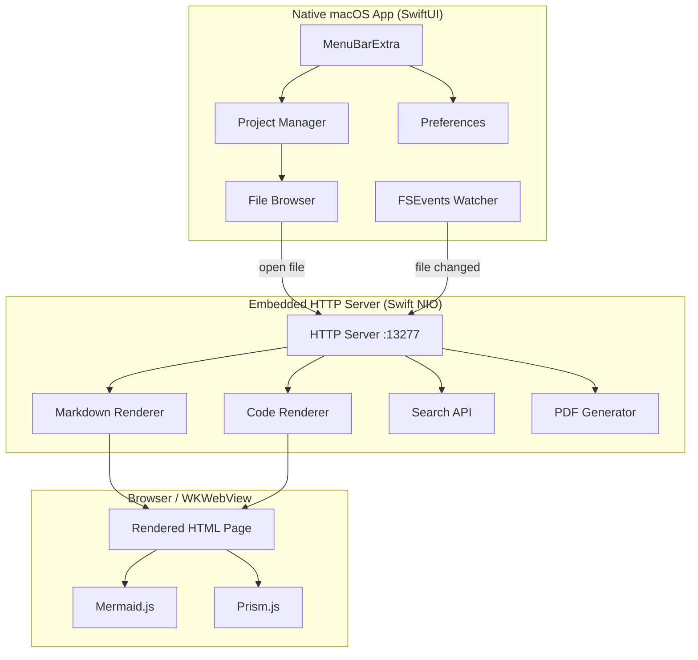

# Moremaid macOS Menubar App — Specification

> Reimplementation of the [moremaid](https://github.com/...) Node.js CLI as a native macOS menubar application using **Swift 6 + SwiftUI** and **Tuist** for project generation.
>
> The original Node.js moremaid source code is in `../` (the parent directory) and can be used as reference — particularly `lib/html-generator.js`, `lib/styles.js`, `lib/server.js`, `lib/config.js`, `lib/virtual-fs.js`, `lib/validator.js`, and `lib/archive-handler.js`.

---

## 0. Project Setup & Tooling

### Tuist

Use [Tuist](https://tuist.io/) to generate and manage the Xcode project. No `.xcodeproj` checked into git — only the `Project.swift` manifest.

```
Moremaid/
├── Project.swift              # Tuist manifest
├── Tuist/
│   └── Config.swift
├── Sources/
│   ├── App/                   # @main, MenuBarExtra, WindowGroup
│   ├── Server/                # Embedded HTTP server (actor)
│   ├── FileWatcher/           # FSEvents via AsyncStream (actor)
│   ├── ProjectManager/        # Project CRUD, persistence
│   ├── FileBrowser/           # SwiftUI sidebar views
│   ├── Search/                # MiniSearch-equivalent + content search
│   ├── Archive/               # ZIP pack/unpack
│   ├── Rendering/             # HTML generation, theme CSS, mermaid config
│   ├── Validation/            # Markdown + mermaid syntax checks
│   └── Shared/                # Models, config constants, utilities
├── Resources/
│   ├── Assets.xcassets
│   └── Web/                   # Bundled JS/CSS (mermaid, prism, marked)
├── Tests/
└── macos/SPEC.md              # This file
```

### Recommended SPM Dependencies

| Package | Purpose |
|---------|---------|
| [Hummingbird](https://github.com/hummingbird-project/hummingbird) or [Vapor](https://github.com/vapor/vapor) | Embedded HTTP server (Swift NIO-based) |
| [ZIPFoundation](https://github.com/weichsel/ZIPFoundation) | ZIP archive creation and extraction |
| [swift-markdown](https://github.com/apple/swift-markdown) | Optional: server-side markdown parsing |

### Build & Run

```bash
tuist generate        # Generate Xcode project
tuist build           # Build via CLI
tuist test            # Run tests
```

### Deployment Target

- **macOS 14.0+** (Sonoma) — required for `@Observable`, modern SwiftUI, `MenuBarExtra`, `SMAppService`.

---

## 1. Architecture Overview



### Key Design Decisions

| Decision | Rationale |
|----------|-----------|
| **No Dock icon** (`LSUIElement = true`) | Menubar-only app; no Dock presence |
| **Swift 6 strict concurrency** | `@Observable` for state, `actor` for server & file watcher, `AsyncStream` for FSEvents, `TaskGroup` for parallel operations |
| **Browser for rendering** | Reuse the existing HTML/JS rendering engine (mermaid, prism, marked) unchanged |
| **Native file browser** | Replaces the web-based index page entirely; file selection is SwiftUI, only rendered content goes to browser |
| **Always-on server** | Fixed port 13277, starts at launch, no port scanning needed |

---

## 2. Application Shell

### MenuBarExtra

The app lives entirely in the macOS menubar. The dropdown menu contains:

| Item | Action |
|------|--------|
| **Project list** | Each project shown with name + file count badge; click opens project window |
| **Add Project...** | Opens `NSOpenPanel` (directory picker) |
| Separator | — |
| **Preferences...** | Opens preferences window |
| **Quit Moremaid** | `NSApplication.shared.terminate(nil)` |

### Windows

| Window | Type | Content |
|--------|------|---------|
| **Project window** | `WindowGroup` (per-project) | SwiftUI sidebar file browser + detail area |
| **Preferences window** | `Settings` scene | Default theme, typography, launch-at-login toggle |
| **Rendered file** | Default browser tab | `open http://localhost:13277/view?project=ID&file=PATH` |

### Auto-Launch at Login

Use `SMAppService.mainApp` (macOS 13+) for login item registration. Toggle in preferences.

---

## 3. Project Management

### Data Model

```swift
@Observable
final class Project: Identifiable, Codable {
    let id: UUID
    var name: String
    var path: String            // Absolute path to directory
    var addedDate: Date
    var isActive: Bool
    var themeOverride: String?   // nil = use default
    var typographyOverride: String?
}
```

### Operations

| Operation | Implementation |
|-----------|---------------|
| **Add** | `NSOpenPanel` with `canChooseDirectories: true`, `canChooseFiles: false` |
| **Remove** | Swipe-to-delete or context menu; removes from list only, does not touch files |
| **Rename** | Inline edit in sidebar |
| **Per-project settings** | Theme and typography overrides stored per-project |

### Persistence

Store in `~/Library/Application Support/Moremaid/projects.json` or use `@AppStorage` / `UserDefaults` for simplicity.

---

## 4. File Browser (Native SwiftUI)

The file browser **replaces** the web-based index page. It is a SwiftUI `List` in the project window sidebar.

### View Modes

| Mode | Description | Persisted Key |
|------|-------------|---------------|
| **Flat list** | All files as flat sorted list (default) | `viewMode` |
| **Directory tree** | Hierarchical `OutlineGroup` with collapsible folders | `viewMode` |

### Sortable Columns

6 sort modes, persisted per-project in UserDefaults key `sortMethod`:

| Sort Mode | Key | Description |
|-----------|-----|-------------|
| Name ascending | `name-asc` | `a.path.localeCompare(b.path)` |
| Name descending | `name-desc` | Reverse of above |
| Date newest first | `date-desc` | **Default** — most recently modified first |
| Date oldest first | `date-asc` | Least recently modified first |
| Size largest first | `size-desc` | Largest files first |
| Size smallest first | `size-asc` | Smallest files first |

Column headers are clickable to toggle sort direction (same column toggles asc/desc, clicking a different column defaults to its natural order).

### File Filter Toggle

| State | Filter | Behavior |
|-------|--------|----------|
| **Markdown only** (default) | `*.md`, `*.markdown` | Shows only markdown files |
| **All files** | `*` | Shows all files |
| **Auto-switch** | — | If no markdown files found, automatically switch to all files |

### Ignored Paths

Always skip (hardcoded):
- `.git` directory
- `node_modules` directory
- Hidden files/directories (starting with `.`)

Additionally parse `.gitignore` if present in project root (use the `ignore` npm package equivalent behavior).

### File Metadata Display

Each file row shows:

| Column | Content | Details |
|--------|---------|---------|
| **Name** | Full relative path from project root | e.g. `docs/guide.md` |
| **Size** | Human-readable size | See [Appendix F](#appendix-f-file-size-formatting) |
| **Modified** | Relative time ago | See [Appendix G](#appendix-g-time-ago-formatting). Full date shown as tooltip |

### Interaction

| Action | Result |
|--------|--------|
| Click file | Open rendered view in default browser |
| Cmd+Click file | Open in new browser tab/window |
| Arrow keys | Navigate file list |
| Enter | Open selected file |
| Tab | Switch focus between search field and file list |

---

## 5. File Monitoring (FSEvents)

### Implementation

Use an `actor` wrapping `DispatchSource.makeFileSystemObjectSource` or the `FSEvents` C API, exposed as an `AsyncStream<FileChangeEvent>`.

```swift
actor FileWatcher {
    func watch(directory: String) -> AsyncStream<FileChangeEvent>
    func stopWatching()
}

struct FileChangeEvent {
    let path: String
    let flags: FSEventStreamEventFlags
    let timestamp: Date
}
```

### Behavior

| Feature | Value |
|---------|-------|
| **Scope** | All active project directories, recursive |
| **Debounce** | 200ms — coalesce rapid changes |
| **Gitignore** | Respect `.gitignore` patterns (skip changes in ignored paths) |
| **Live reload** | If a file currently being viewed changes, the browser page should reload |
| **Recently modified** | Surface recently changed files prominently in the file browser (e.g. bold or pinned to top when sorted by date) |

---

## 6. HTTP Server

### Overview

An embedded HTTP server (Swift NIO via Hummingbird or Vapor) runs as an `actor` on a fixed port. It serves rendered HTML when the user opens a file from the native file browser.

### Configuration

| Setting | Value |
|---------|-------|
| **Port** | `13277` (fixed, always-on) |
| **Bind address** | `127.0.0.1` (localhost only) |
| **Startup** | Launches with the app |
| **Shutdown** | When app quits |

### Required Features

The server must support these capabilities. URL patterns are implementation-flexible — the exact endpoints can differ from the Node.js version as long as the features are covered:

| Feature | Description |
|---------|-------------|
| **Render markdown** | Accept a project ID + file path, render markdown to full HTML page with mermaid/prism/themes |
| **Render code** | Accept a project ID + file path for non-markdown files, render with Prism.js syntax highlighting |
| **Raw file content** | Return raw file content as `text/plain` (used by copy button) |
| **Content search** | Accept a query + project ID, return JSON results with context lines |
| **PDF export** | Generate PDF from rendered markdown (see [Section 13](#13-pdf-export)) |
| **Favicon** | Return 204 for `/favicon.ico` |

### Security

| Check | Implementation |
|-------|---------------|
| **Path traversal** | Resolved file path MUST start with the project's base directory. Reject with 403 otherwise |
| **Localhost only** | Bind to `127.0.0.1`, not `0.0.0.0` |

### Live Reload

When FSEvents detects a file change:
1. If the file is currently being viewed in a browser tab, send a reload signal
2. Options: WebSocket push, Server-Sent Events, or meta-refresh polling

The Node.js version uses WebSocket (`/ws` endpoint) for connection tracking and cleanup. The macOS version should implement similar live-reload capability, but the mechanism is flexible (WebSocket, SSE, or polling).

---

## 7. Rendering Engine

The server generates HTML pages for viewing files. The native SwiftUI app opens the user's default browser to these pages. The web-based index/overlay page from the Node.js version is **NOT needed** — the native SwiftUI file browser replaces it entirely.

### 7.1 Markdown View

The server generates a complete HTML document from markdown content. Key processing steps:

#### Markdown Parser Configuration (marked.js)

```javascript
marked.setOptions({
    breaks: true,
    gfm: true,
    langPrefix: 'language-'
});
```

#### Heading ID Generation

All headings get auto-generated IDs for fragment navigation:

```
text → lowercase → remove special chars [^\w\s-] → spaces to dashes → collapse dashes
```

Example: `"Hello World!"` → `id="hello-world"`

#### Language Alias Replacements

After markdown→HTML conversion, these class name replacements are applied:

| From | To |
|------|----|
| `language-js` | `language-javascript` |
| `language-ts` | `language-typescript` |
| `language-py` | `language-python` |
| `language-rb` | `language-ruby` |
| `language-yml` | `language-yaml` |
| `language-sh` | `language-bash` |
| `language-shell` | `language-bash` |
| `language-cs` | `language-csharp` |

#### Mermaid Block Processing

Regex: `` <pre><code class="language-mermaid">...</code></pre> ``

Replace with: `<div class="mermaid">DECODED_CONTENT</div>`

HTML entities decoded: `&lt;` → `<`, `&gt;` → `>`, `&amp;` → `&`, `&quot;` → `"`, `&#39;` → `'`

#### Page Structure

```html
<!DOCTYPE html>
<html lang="en">
<head>
    <!-- Theme CSS variables (all 10 themes via [data-theme="X"]) -->
    <!-- Typography CSS variables (all 10 styles via [data-typography="X"]) -->
    <!-- Mermaid.js v10 from CDN -->
    <!-- Prism.js v1.29.0 from CDN (core + autoloader) -->
</head>
<body data-typography="default">
    <!-- Controls trigger button (⚙ gear icon, bottom-left) -->
    <!-- Controls panel: zoom, theme selector, typography selector -->
    <!-- File buttons: Copy, PDF (top-right) -->
    <!-- Zoom container → Container → Content -->
    <script>
        // Theme init (localStorage 'theme' or system preference)
        // Typography init (localStorage 'preferredTypography')
        // Zoom init (localStorage 'zoom', range 50-200, step 10)
        // Mermaid init with per-theme variables
        // Code block copy buttons
        // Fullscreen mermaid window support
        // WebSocket for live reload
        // Search highlighting (if search query param present)
    </script>
</body>
</html>
```

#### Controls UI

| Control | Position | Details |
|---------|----------|---------|
| **Settings gear** (⚙) | Fixed, bottom-left | Toggle button, opacity 0.3 → 0.6 on hover |
| **Controls panel** | Fixed, bottom-left | Shown/hidden on gear click. Contains: zoom, theme dropdown, typography dropdown |
| **Copy button** | Fixed, top-right | Copies raw markdown to clipboard |
| **PDF button** | Fixed, top-right | Triggers PDF download via `/api/pdf` |
| **Zoom** | In controls panel | −, value%, +, reset (⟲). Range: 50%–200%, step: 10% |

#### Theme Selection Logic

```
1. Forced theme (from CLI/project override)  →  use it
2. Saved theme (localStorage 'theme')        →  use it
3. System preference (prefers-color-scheme)   →  'dark' or 'light'
4. Fallback                                   →  'light'
```

#### Prism.js Dark Theme Detection

These themes use `prism-tomorrow.min.css` (dark); all others use `prism.min.css` (light):

```
dark, dracula, solarized-dark, monokai, one-dark, nord
```

> **Note:** The current Node.js code (`generateCodeView`) does NOT include `github-dark` in the dark detection list — this appears to be an oversight. The macOS implementation should include `github-dark` as dark.

### 7.2 Code View

For non-markdown files, the server generates a syntax-highlighted code page.

#### File Extension → Language Map

| Extension | Language | Extension | Language |
|-----------|----------|-----------|----------|
| `js` | javascript | `swift` | swift |
| `ts` | typescript | `kt` | kotlin |
| `jsx` | jsx | `r` | r |
| `tsx` | tsx | `pl` | perl |
| `py` | python | `lua` | lua |
| `rb` | ruby | `vim` | vim |
| `yml` | yaml | `dockerfile` | docker |
| `yaml` | yaml | `makefile` | makefile |
| `json` | json | `txt` | plaintext |
| `xml` | xml | `c` | c |
| `html` | html | `cpp` | cpp |
| `css` | css | `h` | c |
| `scss` | scss | `hpp` | cpp |
| `sass` | sass | `cs` | csharp |
| `sh` | bash | `go` | go |
| `bash` | bash | `rs` | rust |
| `sql` | sql | `php` | php |
| `java` | java | | |

**35 extensions** mapped to **31 unique languages**.

### 7.3 Mermaid Fullscreen Window

When the user clicks the fullscreen button (⛶) on a mermaid diagram:

1. A new browser window opens (`window.open`, 800×600, scrollable, resizable)
2. Contains the mermaid diagram definition rendered standalone
3. Inherits the current theme's background color and mermaid variables
4. **Parent polling**: Child window polls every **500ms** — if parent window is closed or inaccessible, child auto-closes
5. Parent tracks child windows in `window.childWindows[]` array
6. On WebSocket disconnect (server stop), parent closes all children before closing itself (100ms delay)

#### Per-Theme Background Colors for Fullscreen

| Theme | Background |
|-------|-----------|
| light | `white` |
| dark | `#1a1a1a` |
| github | `#ffffff` |
| github-dark | `#0d1117` |
| dracula | `#282a36` |
| nord | `#2e3440` |
| solarized-light | `#fdf6e3` |
| solarized-dark | `#002b36` |
| monokai | `#272822` |
| one-dark | `#282c34` |

---

## 8. Search System

Search is split between native SwiftUI (for the file browser) and the HTTP server (for content search and highlighting).

### 8.1 Filename Search (Native)

Implemented in SwiftUI as a search field in the file browser toolbar.

Equivalent to the Node.js MiniSearch configuration:

```javascript
new MiniSearch({
    fields: ['fileName', 'path'],
    storeFields: ['path', 'fileName', 'directory'],
    searchOptions: {
        boost: { fileName: 2 },
        fuzzy: 0.2,
        prefix: true
    }
});
```

| Parameter | Value | Meaning |
|-----------|-------|---------|
| `boost.fileName` | `2` | File name matches score 2× higher than path matches |
| `fuzzy` | `0.2` | Allow ~20% edit distance for fuzzy matching |
| `prefix` | `true` | Match partial terms as prefixes |

### 8.2 Content Search (Server-Side)

The server provides a content search endpoint. Implementation:

| Parameter | Value |
|-----------|-------|
| **Matching** | Case-insensitive substring match, line-by-line |
| **Context** | 3 lines per match: previous line, matching line, next line |
| **Max matches per file** | 5 |
| **Line trim** | 200 characters max per line |
| **Result format** | JSON array of `{ path, fileName, directory, matches[] }` |

Each match contains:

```json
{
    "lineNumber": 42,
    "text": "The matching line content...",
    "contextLines": [
        { "lineNumber": 41, "text": "Line before", "isMatch": false },
        { "lineNumber": 42, "text": "The matching line content...", "isMatch": true },
        { "lineNumber": 43, "text": "Line after", "isMatch": false }
    ]
}
```

### 8.3 Search Mode Toggle

| Mode | Trigger | Behavior |
|------|---------|----------|
| **Filename** (default) | Type in search field | Fuzzy filename matching in native UI |
| **Content** | Shift+Tab toggles mode | Full-text search via server API |

### 8.4 Highlighting in Rendered View

When the user navigates to a search result, the rendered HTML page receives a `search` query parameter. The page highlights matching terms:

| Property | Value |
|----------|-------|
| **Mark color** | `#ffeb3b` background, `#333` text |
| **Highlight animation** | Flash to `#ffd54f` for 500ms, then settle to `#ffeb3b` |
| **Scroll behavior** | `scrollIntoView({ behavior: 'smooth', block: 'center' })` |
| **Min term length** | 2 characters (terms < 2 chars are ignored) |

---

## 9. Theming & Typography

### 9.1 Theme CSS Variables

All 10 themes define these **16 CSS custom properties** via `[data-theme="X"]` selectors. An additional `--bg-color-rgb` variable provides the RGB components for use in `rgba()`.

See **[Appendix A](#appendix-a-theme-css-variables)** for the complete table with all hex values.

### Theme-to-Mermaid Mapping

| Theme | Mermaid Base Theme |
|-------|--------------------|
| light | `default` |
| dark | `dark` |
| github | `default` |
| github-dark | `dark` |
| dracula | `dark` |
| nord | `dark` |
| solarized-light | `default` |
| solarized-dark | `dark` |
| monokai | `dark` |
| one-dark | `dark` |

### 9.2 Typography Styles

All 10 typography styles define these **8 CSS custom properties** via `[data-typography="X"]` selectors.

See **[Appendix B](#appendix-b-typography-css-variables)** for the complete table.

### Special Typography Behaviors

| Style | Special Rule |
|-------|-------------|
| **book** | `p + p { text-indent: 2em; }` — consecutive paragraphs get first-line indent |
| **newspaper** | `@media (min-width: 1200px) { column-count: 3; column-gap: 2em; column-rule: 1px solid var(--border-color); }` |

---

## 10. Mermaid Integration

### Supported Diagram Types

17 types recognized by the validator:

| # | Type | # | Type |
|---|------|---|------|
| 1 | `graph` | 10 | `pie` |
| 2 | `flowchart` | 11 | `quadrantChart` |
| 3 | `sequenceDiagram` | 12 | `requirementDiagram` |
| 4 | `classDiagram` | 13 | `gitGraph` |
| 5 | `stateDiagram` | 14 | `mindmap` |
| 6 | `stateDiagram-v2` | 15 | `timeline` |
| 7 | `erDiagram` | 16 | `zenuml` |
| 8 | `journey` | 17 | `sankey-beta` |
| 9 | `gantt` | | |

### Per-Theme Mermaid Variables

See **[Appendix C](#appendix-c-mermaid-theme-variables)** for the complete variable sets.

### Theme → Variable Set Mapping

| App Theme | Variable Set Used |
|-----------|-------------------|
| light, solarized-light | `light` |
| dark, one-dark | `dark` |
| github | `github` |
| github-dark | `github` + `{ background: "#0d1117" }` |
| dracula | `dracula` |
| nord | `nord` |
| solarized-dark | `solarized` + `{ background: "#002b36" }` |
| monokai | `monokai` |

### Initialization

```javascript
mermaid.initialize({
    startOnLoad: false,   // Manual rendering after DOM ready
    theme: mermaidTheme,  // 'default' or 'dark'
    themeVariables: variables
});
```

Diagrams are rendered one-by-one after `DOMContentLoaded` using `mermaid.render(id, definition)`.

---

## 11. Archive / Pack Mode

### Pack (Create Archive)

| Setting | Value |
|---------|-------|
| **Format** | ZIP |
| **Extension** | `.moremaid` |
| **Encryption** | AES-256 (optional, prompted at pack time) |
| **Compression** | Level 9 (maximum) |
| **Auto-README** | If no `README.md` exists, generate one listing all packed files |

Swift equivalent: Use `ZIPFoundation` with `AESEncryption`.

### Serve (Open Archive)

| Setting | Value |
|---------|-------|
| **Reading** | Entirely in-memory (no extraction to disk) |
| **Cache** | LRU cache, 100MB default max |
| **Pre-cached files** | `README.md`, `readme.md`, `index.md` |
| **Password detection** | Try opening without password first; if any entry is encrypted, prompt for password |
| **Search** | Built-in `searchInFiles()` on the in-memory ZIP contents |

### LRU Cache

```swift
actor LRUCache {
    let maxSize: Int  // Default: 100 * 1024 * 1024 (100MB)
    var currentSize: Int
    var cache: OrderedDictionary<String, CacheEntry>

    func get(_ key: String) -> Data?
    func set(_ key: String, value: Data)
    func clear()
    func stats() -> CacheStats
}
```

---

## 12. Validation Engine

Invoked for pre-flight checks or as a standalone utility.

### Markdown Validation

Parse with `marked` (or Swift equivalent). Catch and report parsing errors.

### Mermaid Validation

| Check | Details |
|-------|---------|
| **Empty block** | Error if mermaid block has no content |
| **Diagram type** | First line must start with one of the 17 recognized types (see Section 10) |
| **Bracket matching** | Check `()`, `[]`, `{}` are balanced; report unmatched brackets with line numbers |
| **Flowchart-specific** | For `flowchart`/`graph` types: check arrow syntax (`-->`), check node labels for problematic characters (leading `/`, multiple unescaped slashes, path-like text after `<br>`) |

### Error Reporting

```swift
struct ValidationResult {
    let files: [FileValidation]
    let totalStats: ValidationStats
}

struct FileValidation {
    let path: String
    let errors: [ValidationError]
    let stats: FileStats  // markdownErrors, mermaidErrors, mermaidBlocksChecked
}

struct ValidationError {
    let type: ErrorType  // .markdown, .mermaid, .file
    let line: Int?
    let message: String
}
```

---

## 13. PDF Export

### Recommended Approach

Use `WKWebView.createPDF(configuration:)` (macOS 12+) for native PDF generation without Puppeteer.

### Process

1. Load the rendered HTML into an off-screen `WKWebView`
2. Wait for mermaid diagrams to render
3. Inject CSS to hide UI elements:

```css
.file-buttons-container,
.copy-file-btn,
.download-pdf-btn,
.file-info,
#settingsButton,
.controls {
    display: none !important;
}
```

4. Generate PDF with these settings:

| Setting | Value |
|---------|-------|
| **Paper size** | A4 |
| **Top margin** | 20mm |
| **Right margin** | 20mm |
| **Bottom margin** | 25mm |
| **Left margin** | 20mm |
| **Background** | Print background colors |
| **Footer** | `<filename>` (left) + `<page> of <total>` (right), 10px font |

5. Return PDF as `application/pdf` with `Content-Disposition: attachment`

---

## 14. Keyboard Shortcuts

### File Browser (Native SwiftUI)

| Shortcut | Action |
|----------|--------|
| `Cmd+K` | Focus search field, select all |
| `/` | Focus search field, select all (when not in input) |
| `Cmd+Shift+F` | Toggle file filter (*.md ↔ *) |
| `Tab` | Move focus: search → file list |
| `Shift+Tab` | Toggle search mode (filename ↔ content) |
| `↑` / `↓` | Navigate file list |
| `Enter` | Open selected file |
| `Escape` | Close overlay / dismiss modal |
| `?` | Open help modal (when not in input) |

### Rendered View (Browser)

| Shortcut | Action |
|----------|--------|
| `Cmd+` / `Cmd+=` | Zoom in (+10%) |
| `Cmd-` | Zoom out (−10%) |
| `Cmd+0` | Reset zoom to 100% |
| `Escape` | Close help modal |
| `?` | Open help modal (when not in input) |

---

## 15. State Persistence

State is stored in two locations depending on where it's used:

### Web-Side (localStorage in served HTML pages)

These are persisted by the browser because the rendered pages run in the browser context:

| Key | Default | Description |
|-----|---------|-------------|
| `theme` | System preference or `'light'` | Selected color theme |
| `preferredTypography` | `'default'` | Selected typography style |
| `zoom` | `100` | Zoom level (50–200) |

### Native-Side (UserDefaults / App Support)

| Key | Default | Description |
|-----|---------|-------------|
| `projects` | `[]` | Array of `Project` objects |
| `sortMethod` | `'date-desc'` | File list sort order |
| `viewMode` | `'flat'` | File browser view mode (flat/tree) |
| `defaultTheme` | `'light'` | Default theme for new projects |
| `defaultTypography` | `'default'` | Default typography for new projects |
| `launchAtLogin` | `false` | Auto-launch at login |

---

## 16. Configuration Constants

All magic values from the Node.js codebase:

| Constant | Value | Context |
|----------|-------|---------|
| `SERVER_PORT` | `13277` | HTTP server port |
| `MAX_PORT_ATTEMPTS` | `10` | Port scan attempts (legacy, not needed if fixed) |
| `INACTIVITY_TIMEOUT` | `10000` ms | Temp directory cleanup |
| `WS_RECONNECT_DELAY` | `500` ms | Grace period before shutdown on disconnect |
| `WS_PING_INTERVAL` | `30000` ms | WebSocket keep-alive ping |
| `ZOOM_MIN` | `50` | Minimum zoom percentage |
| `ZOOM_MAX` | `200` | Maximum zoom percentage |
| `ZOOM_STEP` | `10` | Zoom increment/decrement |
| `FSEVENTS_DEBOUNCE` | `200` ms | File watcher debounce |
| `SEARCH_MAX_MATCHES` | `5` | Max content matches per file |
| `SEARCH_LINE_TRIM` | `200` | Max characters per context line |
| `SEARCH_FUZZY` | `0.2` | Fuzzy matching tolerance |
| `SEARCH_MIN_TERM` | `2` | Min chars for search term highlighting |
| `LRU_CACHE_SIZE` | `104857600` (100MB) | Archive cache max size |
| `ARCHIVE_EXTENSION` | `.moremaid` | Archive file extension |
| `MD_EXTENSIONS` | `.md`, `.markdown` | Recognized markdown extensions |
| `PARENT_POLL_INTERVAL` | `500` ms | Mermaid fullscreen parent check |
| `CHILD_CLOSE_DELAY` | `500` ms | Delay before closing main window after children |
| `COPY_FEEDBACK_DURATION` | `2000` ms | "Copied!" text display time |
| `MERMAID_VERSION` | `10` | Mermaid.js major version (CDN) |
| `PRISM_VERSION` | `1.29.0` | Prism.js version (CDN) |
| `PDF_PAPER` | `A4` | PDF paper size |
| `PDF_MARGIN_TOP` | `20mm` | PDF top margin |
| `PDF_MARGIN_RIGHT` | `20mm` | PDF right margin |
| `PDF_MARGIN_BOTTOM` | `25mm` | PDF bottom margin |
| `PDF_MARGIN_LEFT` | `20mm` | PDF left margin |
| `FULLSCREEN_WINDOW_SIZE` | `800×600` | Mermaid fullscreen window default size |

---

## Appendix A: Theme CSS Variables

16 variables per theme. `--bg-color-rgb` provides RGB components for `rgba()` usage.

| Variable | light | dark | github | github-dark | dracula |
|----------|-------|------|--------|-------------|---------|
| `--bg-color` | `white` | `#1a1a1a` | `#ffffff` | `#0d1117` | `#282a36` |
| `--bg-color-rgb` | `255, 255, 255` | `26, 26, 26` | `255, 255, 255` | `13, 17, 23` | `40, 42, 54` |
| `--text-color` | `#333` | `#e0e0e0` | `#24292e` | `#c9d1d9` | `#f8f8f2` |
| `--heading-color` | `#2c3e50` | `#61afef` | `#24292e` | `#58a6ff` | `#bd93f9` |
| `--heading2-color` | `#34495e` | `#56b6c2` | `#24292e` | `#58a6ff` | `#ff79c6` |
| `--border-color` | `#ecf0f1` | `#3a3a3a` | `#e1e4e8` | `#30363d` | `#44475a` |
| `--code-bg` | `#f4f4f4` | `#2d2d2d` | `#f6f8fa` | `#161b22` | `#44475a` |
| `--code-color` | `#d14` | `#e06c75` | `#e36209` | `#ff7b72` | `#ff79c6` |
| `--link-color` | `#3498db` | `#61afef` | `#0366d6` | `#58a6ff` | `#8be9fd` |
| `--blockquote-color` | `#555` | `#abb2bf` | `#6a737d` | `#8b949e` | `#6272a4` |
| `--table-header-bg` | `#f0f0f0` | `#2d2d2d` | `#f6f8fa` | `#161b22` | `#44475a` |
| `--table-border` | `#ddd` | `#4a4a4a` | `#e1e4e8` | `#30363d` | `#6272a4` |
| `--file-info-bg` | `#f5f5f5` | `#2d2d2d` | `#f6f8fa` | `#161b22` | `#44475a` |
| `--file-info-color` | `#666` | `#abb2bf` | `#586069` | `#8b949e` | `#6272a4` |
| `--mermaid-btn-bg` | `rgba(52, 73, 94, 0.8)` | `rgba(97, 175, 239, 0.8)` | `rgba(3, 102, 214, 0.8)` | `rgba(88, 166, 255, 0.8)` | `rgba(189, 147, 249, 0.8)` |
| `--mermaid-btn-hover` | `rgba(52, 73, 94, 1)` | `rgba(97, 175, 239, 1)` | `rgba(3, 102, 214, 1)` | `rgba(88, 166, 255, 1)` | `rgba(189, 147, 249, 1)` |

| Variable | nord | solarized-light | solarized-dark | monokai | one-dark |
|----------|------|-----------------|----------------|---------|----------|
| `--bg-color` | `#2e3440` | `#fdf6e3` | `#002b36` | `#272822` | `#282c34` |
| `--bg-color-rgb` | `46, 52, 64` | `253, 246, 227` | `0, 43, 54` | `39, 40, 34` | `40, 44, 52` |
| `--text-color` | `#eceff4` | `#657b83` | `#839496` | `#f8f8f2` | `#abb2bf` |
| `--heading-color` | `#88c0d0` | `#073642` | `#93a1a1` | `#66d9ef` | `#61afef` |
| `--heading2-color` | `#81a1c1` | `#586e75` | `#839496` | `#a6e22e` | `#e06c75` |
| `--border-color` | `#3b4252` | `#eee8d5` | `#073642` | `#3e3d32` | `#3e4451` |
| `--code-bg` | `#3b4252` | `#eee8d5` | `#073642` | `#3e3d32` | `#3e4451` |
| `--code-color` | `#d08770` | `#dc322f` | `#dc322f` | `#f92672` | `#e06c75` |
| `--link-color` | `#88c0d0` | `#268bd2` | `#268bd2` | `#66d9ef` | `#61afef` |
| `--blockquote-color` | `#d8dee9` | `#839496` | `#657b83` | `#75715e` | `#5c6370` |
| `--table-header-bg` | `#3b4252` | `#eee8d5` | `#073642` | `#3e3d32` | `#3e4451` |
| `--table-border` | `#4c566a` | `#93a1a1` | `#586e75` | `#75715e` | `#4b5263` |
| `--file-info-bg` | `#3b4252` | `#eee8d5` | `#073642` | `#3e3d32` | `#3e4451` |
| `--file-info-color` | `#d8dee9` | `#839496` | `#657b83` | `#75715e` | `#5c6370` |
| `--mermaid-btn-bg` | `rgba(136, 192, 208, 0.8)` | `rgba(38, 139, 210, 0.8)` | `rgba(38, 139, 210, 0.8)` | `rgba(102, 217, 239, 0.8)` | `rgba(97, 175, 239, 0.8)` |
| `--mermaid-btn-hover` | `rgba(136, 192, 208, 1)` | `rgba(38, 139, 210, 1)` | `rgba(38, 139, 210, 1)` | `rgba(102, 217, 239, 1)` | `rgba(97, 175, 239, 1)` |

---

## Appendix B: Typography CSS Variables

8 variables per typography style.

| Variable | default | github | latex |
|----------|---------|--------|-------|
| `--font-body` | `-apple-system, BlinkMacSystemFont, 'Segoe UI', Roboto, 'Helvetica Neue', Arial, sans-serif` | `-apple-system, BlinkMacSystemFont, 'Segoe UI', 'Noto Sans', Helvetica, Arial, sans-serif` | `'Latin Modern Roman', 'Computer Modern', 'Georgia', serif` |
| `--font-heading` | (same as body) | (same as body) | (same as body) |
| `--font-code` | `'Monaco', 'Menlo', 'Ubuntu Mono', 'Courier New', monospace` | `'SFMono-Regular', Consolas, 'Liberation Mono', Menlo, monospace` | `'Latin Modern Mono', 'Computer Modern Typewriter', 'Courier New', monospace` |
| `--font-size-base` | `16px` | `16px` | `12pt` |
| `--line-height` | `1.6` | `1.5` | `1.4` |
| `--paragraph-spacing` | `1em` | `1em` | `0.5em` |
| `--max-width` | `800px` | `1012px` | `6.5in` |
| `--text-align` | `left` | `left` | `justify` |

| Variable | tufte | medium | compact |
|----------|-------|--------|---------|
| `--font-body` | `et-book, Palatino, 'Palatino Linotype', 'Palatino LT STD', 'Book Antiqua', Georgia, serif` | `charter, Georgia, Cambria, 'Times New Roman', Times, serif` | `-apple-system, BlinkMacSystemFont, 'Segoe UI', Roboto, sans-serif` |
| `--font-heading` | (same as body) | `'Lucida Grande', 'Lucida Sans Unicode', 'Lucida Sans', Geneva, Arial, sans-serif` | (same as body) |
| `--font-code` | `Consolas, 'Liberation Mono', Menlo, Courier, monospace` | `'Menlo', 'Monaco', 'Courier New', Courier, monospace` | `'Monaco', 'Menlo', monospace` |
| `--font-size-base` | `15px` | `21px` | `14px` |
| `--line-height` | `1.5` | `1.58` | `1.4` |
| `--paragraph-spacing` | `1.4em` | `1.58em` | `0.5em` |
| `--max-width` | `960px` | `680px` | `100%` |
| `--text-align` | `left` | `left` | `left` |

| Variable | wide | newspaper | terminal | book |
|----------|------|-----------|----------|------|
| `--font-body` | `-apple-system, BlinkMacSystemFont, 'Segoe UI', Roboto, sans-serif` | `'Times New Roman', Times, serif` | `'Fira Code', 'Source Code Pro', 'Monaco', 'Menlo', monospace` | `'Crimson Text', 'Baskerville', 'Georgia', serif` |
| `--font-heading` | (same as body) | `'Georgia', 'Times New Roman', serif` | (same as body) | (same as body) |
| `--font-code` | `'Monaco', 'Menlo', 'Ubuntu Mono', monospace` | `'Courier New', Courier, monospace` | (same as body) | `'Courier New', Courier, monospace` |
| `--font-size-base` | `16px` | `16px` | `14px` | `18px` |
| `--line-height` | `1.7` | `1.5` | `1.5` | `1.7` |
| `--paragraph-spacing` | `1.2em` | `0.8em` | `1em` | `1.5em` |
| `--max-width` | `100%` | `100%` | `900px` | `650px` |
| `--text-align` | `left` | `justify` | `left` | `justify` |

---

## Appendix C: Mermaid Theme Variables

7 named variable sets with exact hex values:

### `light`

```json
{
    "primaryColor": "#3498db",
    "primaryTextColor": "#fff",
    "primaryBorderColor": "#2980b9",
    "lineColor": "#5a6c7d",
    "secondaryColor": "#ecf0f1",
    "tertiaryColor": "#fff"
}
```

### `dark`

```json
{
    "primaryColor": "#61afef",
    "primaryTextColor": "#1a1a1a",
    "primaryBorderColor": "#4b5263",
    "lineColor": "#abb2bf",
    "secondaryColor": "#2d2d2d",
    "tertiaryColor": "#3a3a3a",
    "background": "#1a1a1a",
    "mainBkg": "#61afef",
    "secondBkg": "#56b6c2",
    "tertiaryBkg": "#98c379"
}
```

### `github`

```json
{
    "primaryColor": "#0366d6",
    "primaryTextColor": "#fff",
    "primaryBorderColor": "#0366d6",
    "lineColor": "#586069",
    "secondaryColor": "#f6f8fa"
}
```

### `dracula`

```json
{
    "primaryColor": "#bd93f9",
    "primaryTextColor": "#f8f8f2",
    "primaryBorderColor": "#6272a4",
    "lineColor": "#6272a4",
    "secondaryColor": "#44475a",
    "background": "#282a36"
}
```

### `nord`

```json
{
    "primaryColor": "#88c0d0",
    "primaryTextColor": "#2e3440",
    "primaryBorderColor": "#5e81ac",
    "lineColor": "#4c566a",
    "secondaryColor": "#3b4252",
    "background": "#2e3440"
}
```

### `solarized`

```json
{
    "primaryColor": "#268bd2",
    "primaryTextColor": "#fdf6e3",
    "primaryBorderColor": "#93a1a1",
    "lineColor": "#657b83",
    "secondaryColor": "#eee8d5"
}
```

### `monokai`

```json
{
    "primaryColor": "#66d9ef",
    "primaryTextColor": "#272822",
    "primaryBorderColor": "#75715e",
    "lineColor": "#75715e",
    "secondaryColor": "#3e3d32",
    "background": "#272822"
}
```

### Composite Overrides

| Theme | Base Set | Override |
|-------|----------|---------|
| `github-dark` | `github` | `+ { background: "#0d1117" }` |
| `solarized-dark` | `solarized` | `+ { background: "#002b36" }` |

---

## Appendix D: Language Maps

### Alias Map (Markdown Code Block → Prism Language)

Used during markdown→HTML conversion to fix class names:

| Alias | Maps To |
|-------|---------|
| `js` | `javascript` |
| `ts` | `typescript` |
| `py` | `python` |
| `rb` | `ruby` |
| `yml` | `yaml` |
| `sh` | `bash` |
| `shell` | `bash` |
| `cs` | `csharp` |

### File Extension Map (Code View)

Used when rendering non-markdown files to determine Prism.js language:

| Extension | Language | Extension | Language |
|-----------|----------|-----------|----------|
| `js` | javascript | `swift` | swift |
| `ts` | typescript | `kt` | kotlin |
| `jsx` | jsx | `r` | r |
| `tsx` | tsx | `pl` | perl |
| `py` | python | `lua` | lua |
| `rb` | ruby | `vim` | vim |
| `yml` | yaml | `dockerfile` | docker |
| `yaml` | yaml | `makefile` | makefile |
| `json` | json | `txt` | plaintext |
| `xml` | xml | `c` | c |
| `html` | html | `cpp` | cpp |
| `css` | css | `h` | c |
| `scss` | scss | `hpp` | cpp |
| `sass` | sass | `cs` | csharp |
| `sh` | bash | `go` | go |
| `bash` | bash | `rs` | rust |
| `sql` | sql | `php` | php |
| `java` | java | | |

---

## Appendix E: Mermaid Diagram Types

17 types recognized by the validation engine:

```
graph, flowchart, sequenceDiagram, classDiagram,
stateDiagram, stateDiagram-v2, erDiagram, journey,
gantt, pie, quadrantChart, requirementDiagram,
gitGraph, mindmap, timeline, zenuml, sankey-beta
```

---

## Appendix F: File Size Formatting

```swift
func formatSize(_ bytes: Int) -> String {
    if bytes < 1024 { return "\(bytes) B" }
    if bytes < 1024 * 1024 { return "\(String(format: "%.1f", Double(bytes) / 1024)) KB" }
    if bytes < 1024 * 1024 * 1024 { return "\(String(format: "%.1f", Double(bytes) / (1024 * 1024))) MB" }
    return "\(String(format: "%.1f", Double(bytes) / (1024 * 1024 * 1024))) GB"
}
```

Note: The index page uses a slightly different format without the space (e.g. `42KB` instead of `42.0 KB`). For the native app, use the format with space and one decimal.

---

## Appendix G: Time Ago Formatting

```swift
func formatTimeAgo(_ date: Date) -> String {
    let seconds = Int(Date().timeIntervalSince(date))

    if seconds < 60 { return "just now" }
    let minutes = seconds / 60
    if minutes < 60 { return minutes == 1 ? "1 min ago" : "\(minutes) mins ago" }
    let hours = minutes / 60
    if hours < 24 { return hours == 1 ? "1 hour ago" : "\(hours) hours ago" }
    let days = hours / 24
    if days < 7 { return days == 1 ? "yesterday" : "\(days) days ago" }
    let weeks = days / 7
    if weeks < 4 { return weeks == 1 ? "last week" : "\(weeks) weeks ago" }
    let months = days / 30
    if months < 12 { return months == 1 ? "last month" : "\(months) months ago" }
    let years = days / 365
    return years == 1 ? "last year" : "\(years) years ago"
}
```

Full date tooltip format: `"MMM d, yyyy, h:mm a"` (e.g. "Jan 15, 2025, 2:30 PM") — using `en-US` locale.
